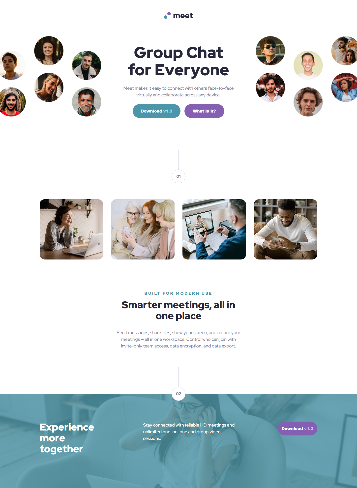

# Frontend Mentor - Meet landing page solution

This is a solution to the [Meet landing page challenge on Frontend Mentor](https://www.frontendmentor.io/challenges/meet-landing-page-rbTDS6OUR). Frontend Mentor challenges help you improve your coding skills by building realistic projects.

## Table of contents

- [Overview](#overview)
  - [The challenge](#the-challenge)
  - [Screenshot](#screenshot)
  - [Links](#links)
- [My process](#my-process)
  - [Built with](#built-with)
  - [What I learned](#what-i-learned)
  - [AI Collaboration](#ai-collaboration)
- [Author](#author)

## Overview

### The challenge

Users should be able to:

- View the optimal layout depending on their device's screen size
- See hover states for interactive elements

### Screenshot



### Links

- Solution URL: [https://github.com/curylo-igor/meet-landing-page](https://github.com/curylo-igor/meet-landing-page)
- Live Site URL: [https://curylo-igor.github.io/meet-landing-page/](https://curylo-igor.github.io/meet-landing-page/)

## My process

### Built with

- Semantic HTML5 markup (use of `<nav>`, `<header>`, `<main>`, `<footer>`, and `<picture>`)
- CSS Custom Properties (Variables for typography system and colors)
- Flexbox layouts for alignments and multi-column rows
- CSS Grid for the responsively shifting four-image gallery
- Mobile-first workflow approach
- Responsive image switching via `<picture>` and media queries

### What I learned

During this project, I significantly improved my understanding of layout orchestration across various screen sizes and advanced text alignment handling.

1. **Responsive Image Splitting with `<picture>`**:
   I learned how to efficiently handle different layout graphics where a mobile screen requires a unified single hero banner, while the desktop screen splits it into two isolated side images (`left` and `right`) flanking the main title. Using a base64 transparent gif spacer helped elegantly manage standard validation rules while avoiding redundant media requests.

   ```html
   <picture class="desktop-only-picture">
     <source
       media="(min-width: 1024px)"
       srcset="./assets/desktop/image-hero-right.png"
     />
     
   </picture>
   ```

2. **Section Intersections & CSS Pseudoelements:**
   Creating the graphical numbered connecting nodes between sections taught me how to blend elements over distinct backgrounds using negative margins alongside custom ::before lines.

```css
.caption-circle {
  width: 56px;
  height: 56px;
  border-radius: 50%;
  position: relative;
  margin-bottom: -28px; /* Perfectly centers the node on the section intersection */
}
```

3. **Background Image Color Underlays:**
   I applied stacked backgrounds inside the <footer> layout, leveraging a uniform linear-gradient layered directly above the underlying cover photo path.

### AI Collaboration

Throughout this project, I collaborated with an AI assistant to brainstorm CSS layout adjustments, clear up responsive scaling hurdles, and fine-tune complex alignments.

- Tools Used: Gemini
- Use Cases: Debugging horizontal viewport spillages, resolving flex distribution bugs (justify-content vs align-items), structuring pixel-perfect element overlaps, and setting up the multi-device <picture> syntax.
- What Worked Well: It saved a lot of time by quickly diagnosing inheritance quirks (like shifting overflow containment properties out from image boundaries onto their specific structural blocks) and explaining layout mechanisms through straightforward, relatable concepts.

## Author

- Frontend Mentor - [@curylo-igor](https://www.frontendmentor.io/profile/curylo-igor)
